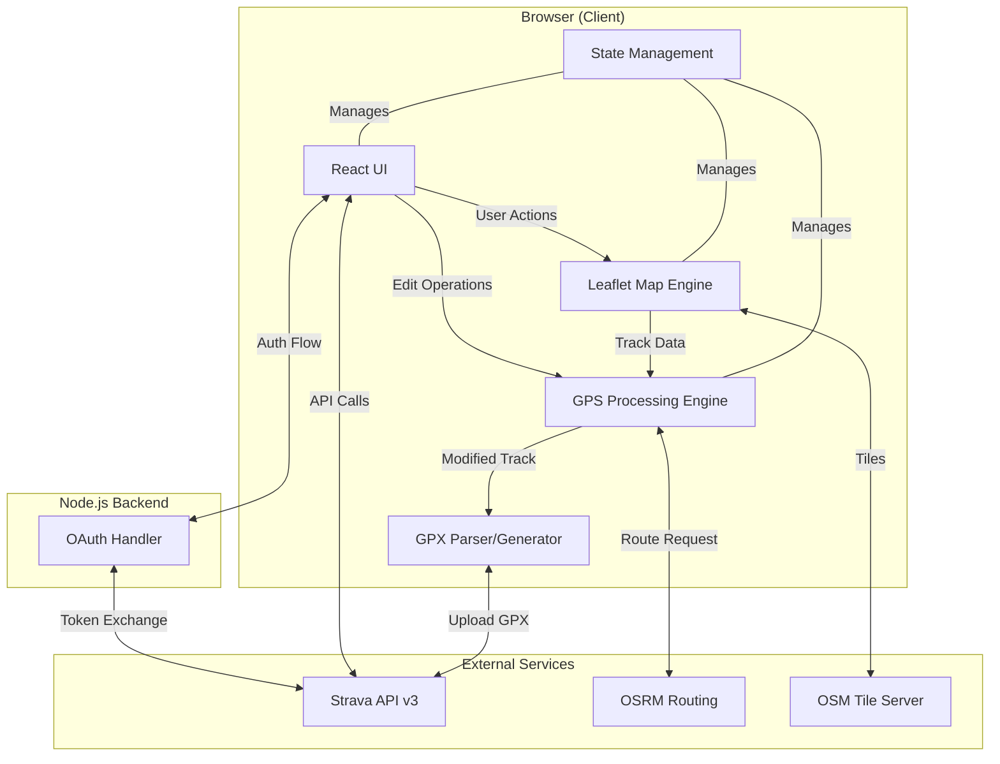
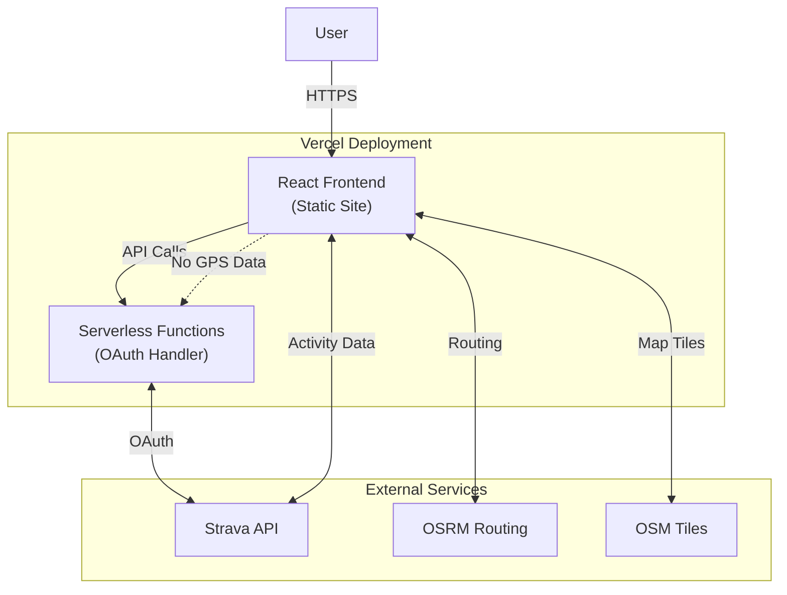

# Design Document

## Overview

The Strava GPS Route Editor is a web-based application that enables endurance athletes to correct GPS inaccuracies in their Strava activities through an intuitive interface. The application integrates seamlessly with Strava's API, allowing users to authenticate, select activities, edit GPS tracks using multiple tools, and re-upload corrected data—all without leaving the application.

### Goals

- Provide seamless OAuth-based Strava authentication
- Enable GPS track editing through four core operations: trim, smooth, spike removal, and redraw
- Support both snap-to-road and freehand drawing modes with real-time toggling
- Re-upload corrected activities to Strava while maintaining metadata
- Ensure complete data privacy compliance with Strava API Agreement

### Technical Stack

**Frontend:**
- React 18+ with TypeScript
- Vite for build tooling
- Tailwind CSS for styling
- Leaflet.js 1.9+ for map rendering
- Leaflet.draw / Leaflet.Editable for polyline editing
- @we-gold/gpxjs for GPX parsing and generation
- Zustand or Redux Toolkit for state management

**Backend (Minimal):**
- Node.js 20+ / Express 4+
- Purpose: OAuth token exchange only
- Serverless deployment (Vercel/Railway)

**External Services:**
- Strava API v3 for authentication and activity data
- OpenStreetMap tiles for base map (free)
- OSRM public API for routing (free, open-source alternative)
- Optional: Mapbox Directions API for premium routing

## Architecture

### System Overview

The application follows a client-heavy architecture where GPS processing occurs entirely in the browser to maintain privacy compliance. The minimal backend server exists solely for secure OAuth token exchange.



### Data Flow

**Authentication Flow:**
1. User clicks "Connect with Strava"
2. Frontend redirects to Strava OAuth page
3. User approves, Strava redirects back with code
4. Frontend sends code to backend
5. Backend exchanges code for access/refresh tokens
6. Backend returns tokens to frontend
7. Frontend stores tokens in sessionStorage (encrypted)

**Activity Editing Flow:**
1. User selects activity from browser
2. Frontend fetches activity metadata from Strava API
3. Frontend fetches GPS streams (latlng, altitude, time) from Strava API
4. GPS data loaded into map and state
5. User applies edits (trim, smooth, spike removal, redraw)
6. All edits processed client-side
7. Modified track maintained in parallel with original
8. User exports as GPX or uploads to Strava

**Privacy-First Processing:**
- All GPS manipulation happens in browser memory
- No GPS data transmitted to backend
- No GPS data persisted to database
- Session data cleared on logout

## Components and Interfaces

### 1. Authentication Module

**Components:**
- `LoginButton.tsx` - Renders Strava-branded OAuth button
- `AuthCallback.tsx` - Handles OAuth redirect
- `useAuth.ts` - Custom hook for auth state
- `tokenService.ts` - Token storage/refresh logic

**Interfaces:**
```typescript
interface AuthTokens {
  accessToken: string;
  refreshToken: string;
  expiresAt: number;
  athleteId: number;
}

interface AuthState {
  isAuthenticated: boolean;
  tokens: AuthTokens | null;
  athlete: AthleteProfile | null;
  login: () => void;
  logout: () => void;
  refreshAccessToken: () => Promise<void>;
}
```

**Backend API:**
```typescript
// POST /api/auth/exchange
interface TokenExchangeRequest {
  code: string;
}

interface TokenExchangeResponse {
  accessToken: string;
  refreshToken: string;
  expiresAt: number;
  athlete: AthleteProfile;
}
```

### 2. Activity Browser Component

**Components:**
- `ActivityList.tsx` - Displays paginated activity list
- `ActivityCard.tsx` - Individual activity preview
- `ActivitySearch.tsx` - Search and filter controls
- `useActivities.ts` - Custom hook for fetching activities

**Interfaces:**
```typescript
interface Activity {
  id: number;
  name: string;
  type: string; // 'Run' | 'Ride' | 'Hike' | etc
  startDate: string;
  distance: number; // meters
  movingTime: number; // seconds
  totalElevationGain: number; // meters
  hasGPS: boolean;
}

interface ActivityFilters {
  searchTerm: string;
  sportType: string | null;
  dateRange: { start: Date; end: Date } | null;
}
```

### 3. Map Interface Component

**Components:**
- `MapView.tsx` - Main Leaflet map container
- `TrackLayer.tsx` - GPS track visualization
- `EditControls.tsx` - Tool selection UI
- `BeforeAfterToggle.tsx` - Original vs edited comparison
- `ElevationChart.tsx` - Optional elevation profile (P2)
- `useMap.ts` - Map state management hook

**Interfaces:**
```typescript
interface GPSPoint {
  lat: number;
  lng: number;
  elevation: number; // meters
  time: Date;
  distance: number; // cumulative meters from start
}

interface GPSTrack {
  points: GPSPoint[];
  totalDistance: number;
  totalTime: number;
  bounds: LatLngBounds;
}

interface MapState {
  originalTrack: GPSTrack | null;
  editedTrack: GPSTrack | null;
  viewMode: 'original' | 'edited' | 'both';
  selectedTool: EditTool | null;
  zoom: number;
  center: LatLng;
}
```

### 4. GPS Editing Tools

**Components:**
- `TrimTool.tsx` - Start/end point handles
- `SmoothTool.tsx` - Smoothing controls
- `SpikeRemovalTool.tsx` - Spike detection UI
- `RedrawTool.tsx` - Redraw mode selector and controls
- `FillGapTool.tsx` - Gap detection and filling
- `EditHistory.tsx` - Undo/redo controls

**Interfaces:**
```typescript
type EditTool = 'trim' | 'smooth' | 'spike-removal' | 'redraw' | 'fill-gap' | 'delete-points';

interface TrimOperation {
  type: 'trim';
  startIndex: number;
  endIndex: number;
}

interface SmoothOperation {
  type: 'smooth';
  algorithm: 'gaussian' | 'moving-average';
  intensity: number; // 0-100
  windowSize: number;
}

interface SpikeRemovalOperation {
  type: 'spike-removal';
  speedThreshold: number; // m/s
  distanceThreshold: number; // meters
  spikesDetected: number[];
  action: 'remove-all' | 'remove-selected';
}

interface RedrawOperation {
  type: 'redraw';
  startIndex: number;
  endIndex: number;
  mode: 'snap-to-road' | 'freehand';
  newPoints: GPSPoint[];
  mixedModes: { mode: 'snap-to-road' | 'freehand'; points: GPSPoint[] }[];
}

interface FillGapOperation {
  type: 'fill-gap';
  gapStart: number;
  gapEnd: number;
  filledPoints: GPSPoint[];
}

type EditOperation = TrimOperation | SmoothOperation | SpikeRemovalOperation | RedrawOperation | FillGapOperation;

interface EditHistory {
  past: EditOperation[];
  future: EditOperation[];
  undo: () => void;
  redo: () => void;
  addOperation: (op: EditOperation) => void;
  reset: () => void;
}
```

### 5. Export & Upload Component

**Components:**
- `ExportButton.tsx` - GPX download
- `UploadToStrava.tsx` - Upload flow with warning
- `UploadProgress.tsx` - Upload status indicator
- `DeleteOriginalConfirmation.tsx` - Optional deletion dialog

**Interfaces:**
```typescript
interface ExportOptions {
  format: 'gpx';
  includeElevation: boolean;
  includeTime: boolean;
}

interface UploadOptions {
  name: string;
  description: string;
  sportType: string;
  gear: string | null;
  deleteOriginal: boolean;
}

interface UploadStatus {
  status: 'idle' | 'uploading' | 'success' | 'error';
  progress: number;
  activityId: number | null;
  error: string | null;
}
```

### 6. State Management

Using Zustand for lightweight, modular state:

```typescript
// stores/authStore.ts
interface AuthStore extends AuthState {}

// stores/activityStore.ts
interface ActivityStore {
  activities: Activity[];
  selectedActivity: Activity | null;
  filters: ActivityFilters;
  loadActivities: (page: number) => Promise<void>;
  selectActivity: (id: number) => Promise<void>;
}

// stores/mapStore.ts
interface MapStore extends MapState {
  loadTrack: (activityId: number) => Promise<void>;
  setViewMode: (mode: 'original' | 'edited' | 'both') => void;
  selectTool: (tool: EditTool | null) => void;
}

// stores/editStore.ts
interface EditStore {
  history: EditHistory;
  applyEdit: (operation: EditOperation) => void;
  getCurrentTrack: () => GPSTrack;
}
```

## Data Models

### GPS Track Structure

```typescript
// Core GPS point with all metadata
class GPSPoint {
  lat: number;
  lng: number;
  elevation: number; // meters above sea level
  time: Date;
  distance: number; // cumulative distance from start in meters

  // Computed properties
  get speed(): number; // meters per second
  get grade(): number; // elevation change percentage

  // Distance calculation
  distanceTo(other: GPSPoint): number;
}

// Complete GPS track with analysis
class GPSTrack {
  points: GPSPoint[];
  metadata: {
    name: string;
    type: string;
    startTime: Date;
    endTime: Date;
  };

  // Computed statistics
  get totalDistance(): number;
  get totalTime(): number;
  get movingTime(): number;
  get averageSpeed(): number;
  get maxSpeed(): number;
  get elevationGain(): number;
  get elevationLoss(): number;
  get bounds(): LatLngBounds;

  // Analysis methods
  detectGaps(): Gap[];
  detectSpikes(speedThreshold: number, distanceThreshold: number): number[];
  smooth(algorithm: 'gaussian' | 'moving-average', params: any): GPSTrack;
  trim(startIndex: number, endIndex: number): GPSTrack;

  // Serialization
  toGPX(): string;
  static fromGPX(gpx: string): GPSTrack;
  static fromStravaStreams(streams: StravaStreams): GPSTrack;
}
```

### Strava API Data Models

```typescript
// From GET /athlete
interface AthleteProfile {
  id: number;
  username: string;
  firstname: string;
  lastname: string;
  profile: string; // URL
}

// From GET /athlete/activities
interface StravaActivity {
  id: number;
  name: string;
  distance: number;
  moving_time: number;
  elapsed_time: number;
  total_elevation_gain: number;
  type: string;
  sport_type: string;
  start_date: string;
  start_date_local: string;
  map: {
    summary_polyline: string;
  };
}

// From GET /activities/{id}/streams
interface StravaStreams {
  latlng: { data: [number, number][] };
  altitude: { data: number[] };
  time: { data: number[] };
  distance: { data: number[] };
}
```

### Edit History Stack

```typescript
// Undo/redo implementation using immutable operations
class EditHistoryManager {
  private past: EditOperation[] = [];
  private future: EditOperation[] = [];
  private baseTrack: GPSTrack;

  constructor(track: GPSTrack) {
    this.baseTrack = track;
  }

  addOperation(op: EditOperation): void {
    this.past.push(op);
    this.future = []; // Clear redo stack
  }

  undo(): GPSTrack | null {
    const op = this.past.pop();
    if (op) {
      this.future.push(op);
      return this.recompute();
    }
    return null;
  }

  redo(): GPSTrack | null {
    const op = this.future.pop();
    if (op) {
      this.past.push(op);
      return this.recompute();
    }
    return null;
  }

  private recompute(): GPSTrack {
    let track = this.baseTrack;
    for (const op of this.past) {
      track = applyOperation(track, op);
    }
    return track;
  }

  reset(): void {
    this.past = [];
    this.future = [];
  }
}
```

## GPS Editing Algorithms

### 1. Spike Detection Algorithm

Based on speed and distance thresholds with configurable sensitivity:

```typescript
function detectSpikes(
  track: GPSTrack,
  speedThreshold: number = 22, // m/s (~50 mph, reasonable for cycling)
  distanceThreshold: number = 100 // meters (sudden jumps)
): number[] {
  const spikeIndices: number[] = [];

  for (let i = 1; i < track.points.length - 1; i++) {
    const prev = track.points[i - 1];
    const curr = track.points[i];
    const next = track.points[i + 1];

    // Calculate instantaneous speed
    const timeDelta = (curr.time.getTime() - prev.time.getTime()) / 1000; // seconds
    const distance = prev.distanceTo(curr);
    const speed = timeDelta > 0 ? distance / timeDelta : 0;

    // Check for sudden distance jump
    const distanceFromPrev = prev.distanceTo(curr);
    const distanceFromNext = curr.distanceTo(next);

    // Detect spike if:
    // 1. Speed exceeds threshold
    // 2. Distance jump exceeds threshold
    // 3. Point forms sharp angle (outlier from trajectory)
    if (
      speed > speedThreshold ||
      distanceFromPrev > distanceThreshold ||
      distanceFromNext > distanceThreshold
    ) {
      spikeIndices.push(i);
    }
  }

  return spikeIndices;
}
```

**Algorithm Choice:**
- Simple threshold-based approach for v1.0
- Future: Hampel filter or statistical outlier detection
- Configurable thresholds per sport type (running vs cycling)

### 2. Track Smoothing Algorithms

**Moving Average Filter:**
```typescript
function smoothMovingAverage(
  track: GPSTrack,
  windowSize: number = 5
): GPSTrack {
  const smoothedPoints: GPSPoint[] = [];
  const halfWindow = Math.floor(windowSize / 2);

  for (let i = 0; i < track.points.length; i++) {
    const start = Math.max(0, i - halfWindow);
    const end = Math.min(track.points.length - 1, i + halfWindow);

    let sumLat = 0, sumLng = 0, sumElev = 0;
    let count = 0;

    for (let j = start; j <= end; j++) {
      sumLat += track.points[j].lat;
      sumLng += track.points[j].lng;
      sumElev += track.points[j].elevation;
      count++;
    }

    smoothedPoints.push({
      ...track.points[i],
      lat: sumLat / count,
      lng: sumLng / count,
      elevation: sumElev / count
    });
  }

  return new GPSTrack(smoothedPoints, track.metadata);
}
```

**Gaussian Smoothing:**
```typescript
function smoothGaussian(
  track: GPSTrack,
  sigma: number = 2 // Standard deviation
): GPSTrack {
  const windowSize = Math.ceil(sigma * 3) * 2 + 1;
  const kernel = generateGaussianKernel(windowSize, sigma);

  return applyKernel(track, kernel);
}

function generateGaussianKernel(size: number, sigma: number): number[] {
  const kernel: number[] = [];
  const center = Math.floor(size / 2);
  let sum = 0;

  for (let i = 0; i < size; i++) {
    const x = i - center;
    const value = Math.exp(-(x * x) / (2 * sigma * sigma));
    kernel.push(value);
    sum += value;
  }

  // Normalize
  return kernel.map(v => v / sum);
}
```

**Performance Target:** <500ms for 50,000 points

### 3. Gap Detection

```typescript
interface Gap {
  startIndex: number;
  endIndex: number;
  distance: number;
  timeDelta: number;
}

function detectGaps(
  track: GPSTrack,
  minTimeDelta: number = 60 // seconds
): Gap[] {
  const gaps: Gap[] = [];

  for (let i = 0; i < track.points.length - 1; i++) {
    const curr = track.points[i];
    const next = track.points[i + 1];

    const timeDelta = (next.time.getTime() - curr.time.getTime()) / 1000;

    if (timeDelta >= minTimeDelta) {
      gaps.push({
        startIndex: i,
        endIndex: i + 1,
        distance: curr.distanceTo(next),
        timeDelta
      });
    }
  }

  return gaps;
}
```

### 4. Redraw with Mode Toggle

The redraw feature supports both snap-to-road routing and freehand drawing with real-time mode toggling:

**Snap-to-Road Implementation:**
```typescript
async function snapToRoad(
  startPoint: GPSPoint,
  endPoint: GPSPoint,
  viaPoints: GPSPoint[] = []
): Promise<GPSPoint[]> {
  // Use OSRM public API
  const coordinates = [startPoint, ...viaPoints, endPoint]
    .map(p => `${p.lng},${p.lat}`)
    .join(';');

  const url = `https://router.project-osrm.org/route/v1/foot/${coordinates}?overview=full&geometries=geojson`;

  try {
    const response = await fetch(url);
    const data = await response.json();

    if (data.routes && data.routes.length > 0) {
      const coords = data.routes[0].geometry.coordinates;
      return coords.map(([lng, lat], i) => ({
        lat,
        lng,
        elevation: interpolateElevation(startPoint, endPoint, i, coords.length),
        time: interpolateTime(startPoint, endPoint, i, coords.length),
        distance: 0 // Will be recalculated
      }));
    }
  } catch (error) {
    throw new Error('Routing service unavailable');
  }

  return [];
}
```

**Freehand Drawing Implementation:**
```typescript
// Uses Leaflet.Editable for interactive polyline drawing
class FreehandDrawer {
  private map: L.Map;
  private drawnPoints: GPSPoint[] = [];

  startDrawing(startPoint: GPSPoint): void {
    // Enable Leaflet.Editable polyline mode
    const polyline = this.map.editTools.startPolyline();

    polyline.on('editable:vertex:new', (e: any) => {
      const latlng = e.latlng;
      this.drawnPoints.push({
        lat: latlng.lat,
        lng: latlng.lng,
        elevation: 0, // Can be fetched from elevation API
        time: new Date(),
        distance: 0
      });
    });
  }

  finishDrawing(): GPSPoint[] {
    return this.drawnPoints;
  }
}
```

**Mode Toggle Support:**
```typescript
interface RedrawState {
  mode: 'snap-to-road' | 'freehand';
  segments: Array<{
    mode: 'snap-to-road' | 'freehand';
    points: GPSPoint[];
  }>;
  currentSegmentStart: GPSPoint | null;
}

class RedrawTool {
  private state: RedrawState;

  toggleMode(): void {
    // Save current segment
    if (this.state.currentSegmentStart) {
      this.finalizeCurrentSegment();
    }

    // Switch mode
    this.state.mode = this.state.mode === 'snap-to-road' ? 'freehand' : 'snap-to-road';
  }

  async finalizeRedraw(): Promise<GPSPoint[]> {
    // Combine all segments
    const allPoints: GPSPoint[] = [];

    for (const segment of this.state.segments) {
      allPoints.push(...segment.points);
    }

    return allPoints;
  }
}
```

This design allows users to:
1. Start redrawing in either snap-to-road or freehand mode
2. Toggle between modes at any point using a button
3. Create mixed-mode routes (e.g., snap-to-road for paved sections, freehand for trails)
4. See real-time preview of the redrawn section

## API Integration

### Strava OAuth 2.0 Flow

**Step 1: Authorization Request**
```typescript
const STRAVA_AUTH_URL = 'https://www.strava.com/oauth/authorize';
const CLIENT_ID = process.env.VITE_STRAVA_CLIENT_ID;
const REDIRECT_URI = `${window.location.origin}/auth/callback`;
const SCOPE = 'activity:read_all,activity:write';

function initiateStravaAuth() {
  const params = new URLSearchParams({
    client_id: CLIENT_ID,
    redirect_uri: REDIRECT_URI,
    response_type: 'code',
    scope: SCOPE,
    approval_prompt: 'auto'
  });

  window.location.href = `${STRAVA_AUTH_URL}?${params}`;
}
```

**Step 2: Token Exchange (Backend)**
```typescript
// POST /api/auth/exchange
app.post('/api/auth/exchange', async (req, res) => {
  const { code } = req.body;

  const response = await fetch('https://www.strava.com/oauth/token', {
    method: 'POST',
    headers: { 'Content-Type': 'application/json' },
    body: JSON.stringify({
      client_id: process.env.STRAVA_CLIENT_ID,
      client_secret: process.env.STRAVA_CLIENT_SECRET,
      code,
      grant_type: 'authorization_code'
    })
  });

  const data = await response.json();

  res.json({
    accessToken: data.access_token,
    refreshToken: data.refresh_token,
    expiresAt: data.expires_at * 1000,
    athlete: data.athlete
  });
});
```

**Step 3: Token Refresh**
```typescript
async function refreshAccessToken(refreshToken: string): Promise<AuthTokens> {
  const response = await fetch('/api/auth/refresh', {
    method: 'POST',
    headers: { 'Content-Type': 'application/json' },
    body: JSON.stringify({ refreshToken })
  });

  return await response.json();
}
```

### Strava API Endpoints

**1. Fetch Activities**
```typescript
// GET /athlete/activities
async function fetchActivities(
  accessToken: string,
  page: number = 1,
  perPage: number = 30
): Promise<Activity[]> {
  const response = await fetch(
    `https://www.strava.com/api/v3/athlete/activities?page=${page}&per_page=${perPage}`,
    {
      headers: {
        'Authorization': `Bearer ${accessToken}`
      }
    }
  );

  return await response.json();
}
```

**2. Fetch Activity Streams**
```typescript
// GET /activities/{id}/streams
async function fetchActivityStreams(
  accessToken: string,
  activityId: number
): Promise<GPSTrack> {
  const keys = 'latlng,altitude,time,distance';
  const response = await fetch(
    `https://www.strava.com/api/v3/activities/${activityId}/streams?keys=${keys}&key_by_type=true`,
    {
      headers: {
        'Authorization': `Bearer ${accessToken}`
      }
    }
  );

  const streams = await response.json();
  return GPSTrack.fromStravaStreams(streams);
}
```

**3. Upload GPX**
```typescript
// POST /uploads
async function uploadGPX(
  accessToken: string,
  gpxFile: Blob,
  options: UploadOptions
): Promise<UploadStatus> {
  const formData = new FormData();
  formData.append('file', gpxFile);
  formData.append('data_type', 'gpx');
  formData.append('name', options.name);
  formData.append('description', options.description);
  formData.append('activity_type', options.sportType);

  const response = await fetch('https://www.strava.com/api/v3/uploads', {
    method: 'POST',
    headers: {
      'Authorization': `Bearer ${accessToken}`
    },
    body: formData
  });

  const data = await response.json();

  // Poll for upload status
  return pollUploadStatus(accessToken, data.id);
}
```

**4. Delete Activity (Optional)**
```typescript
// DELETE /activities/{id}
async function deleteActivity(
  accessToken: string,
  activityId: number
): Promise<void> {
  await fetch(`https://www.strava.com/api/v3/activities/${activityId}`, {
    method: 'DELETE',
    headers: {
      'Authorization': `Bearer ${accessToken}`
    }
  });
}
```

### Rate Limiting Strategy

Strava API limits:
- 200 requests per 15 minutes
- 2,000 requests per day

**Implementation:**
```typescript
class RateLimiter {
  private requests15min: number[] = [];
  private requestsDaily: number[] = [];

  async checkAndWait(): Promise<void> {
    const now = Date.now();

    // Clean old requests
    this.requests15min = this.requests15min.filter(t => now - t < 15 * 60 * 1000);
    this.requestsDaily = this.requestsDaily.filter(t => now - t < 24 * 60 * 60 * 1000);

    // Check limits
    if (this.requests15min.length >= 200) {
      const waitTime = 15 * 60 * 1000 - (now - this.requests15min[0]);
      await sleep(waitTime);
    }

    if (this.requestsDaily.length >= 2000) {
      throw new Error('Daily rate limit exceeded');
    }

    // Record request
    this.requests15min.push(now);
    this.requestsDaily.push(now);
  }
}
```

### OSRM Routing Integration

```typescript
async function getRoute(
  points: GPSPoint[],
  profile: 'foot' | 'bike' | 'car' = 'foot'
): Promise<GPSPoint[]> {
  const coordinates = points.map(p => `${p.lng},${p.lat}`).join(';');
  const url = `https://router.project-osrm.org/route/v1/${profile}/${coordinates}`;

  const params = new URLSearchParams({
    overview: 'full',
    geometries: 'geojson',
    steps: 'false'
  });

  const response = await fetch(`${url}?${params}`);
  const data = await response.json();

  if (data.code !== 'Ok') {
    throw new Error('Routing failed');
  }

  return data.routes[0].geometry.coordinates.map(([lng, lat]) => ({
    lat,
    lng,
    elevation: 0,
    time: new Date(),
    distance: 0
  }));
}
```

## Error Handling

### Error Categories

1. **Authentication Errors**
   - OAuth failure
   - Token expiration
   - Token refresh failure
   - Invalid credentials

2. **API Errors**
   - Rate limit exceeded
   - Network timeout
   - Invalid activity ID
   - Insufficient permissions

3. **Processing Errors**
   - Invalid GPS data
   - Track too large (>50k points)
   - Routing service unavailable
   - GPX generation failure

4. **Upload Errors**
   - Upload timeout
   - Invalid GPX format
   - Duplicate activity
   - Server error

### Error Handling Strategy

```typescript
class AppError extends Error {
  constructor(
    message: string,
    public code: string,
    public recoverable: boolean = true,
    public userMessage?: string
  ) {
    super(message);
  }
}

// Error boundary for React components
class ErrorBoundary extends React.Component<Props, State> {
  static getDerivedStateFromError(error: Error) {
    return { hasError: true, error };
  }

  componentDidCatch(error: Error, errorInfo: React.ErrorInfo) {
    if (error instanceof AppError) {
      // Log to error tracking service
      logError(error, errorInfo);

      // Show user-friendly message
      if (!error.recoverable) {
        this.setState({ fatalError: true });
      }
    }
  }

  render() {
    if (this.state.hasError) {
      return <ErrorFallback error={this.state.error} />;
    }

    return this.props.children;
  }
}

// API call wrapper with retry logic
async function apiCallWithRetry<T>(
  fn: () => Promise<T>,
  retries: number = 3
): Promise<T> {
  for (let i = 0; i < retries; i++) {
    try {
      return await fn();
    } catch (error) {
      if (i === retries - 1) throw error;

      // Exponential backoff
      await sleep(Math.pow(2, i) * 1000);
    }
  }

  throw new Error('Max retries exceeded');
}
```

### User-Facing Error Messages

```typescript
const ERROR_MESSAGES = {
  'auth/oauth-failed': 'Failed to connect to Strava. Please try again.',
  'auth/token-expired': 'Your session has expired. Please log in again.',
  'api/rate-limit': 'Too many requests. Please wait a few minutes.',
  'api/not-found': 'Activity not found. It may have been deleted.',
  'processing/invalid-gps': 'This activity does not have valid GPS data.',
  'processing/too-large': 'This track is too large to process (>50,000 points).',
  'routing/unavailable': 'Routing service is unavailable. Please use freehand mode.',
  'upload/failed': 'Upload failed. Please try downloading the GPX and uploading manually to Strava.'
};
```

## Privacy & Compliance

### Data Handling Principles

1. **No Server-Side GPS Storage**
   - All GPS processing happens in browser
   - Backend never receives GPS coordinates
   - No database for GPS data

2. **Session Storage Only**
   - Tokens stored in sessionStorage (cleared on tab close)
   - Optional: encrypted localStorage for "remember me"
   - No cookies for authentication

3. **7-Day Cache Limit**
   - If caching activity metadata, expire after 7 days
   - Implemented with cache headers and TTL

4. **HTTPS Enforcement**
   - All API calls over HTTPS
   - Strict Transport Security headers
   - No mixed content

### Implementation

```typescript
// Token storage with encryption
class SecureStorage {
  private encrypt(data: string): string {
    // Use Web Crypto API for encryption
    return btoa(data); // Simplified; use actual encryption
  }

  private decrypt(data: string): string {
    return atob(data);
  }

  setTokens(tokens: AuthTokens): void {
    const encrypted = this.encrypt(JSON.stringify(tokens));
    sessionStorage.setItem('auth_tokens', encrypted);
  }

  getTokens(): AuthTokens | null {
    const encrypted = sessionStorage.getItem('auth_tokens');
    if (!encrypted) return null;

    try {
      return JSON.parse(this.decrypt(encrypted));
    } catch {
      return null;
    }
  }

  clearTokens(): void {
    sessionStorage.removeItem('auth_tokens');
    localStorage.removeItem('auth_tokens');
  }
}

// Client-side GPS processing
class GPSProcessor {
  // All methods operate on in-memory data only
  // No network calls for GPS data

  processTrack(track: GPSTrack): GPSTrack {
    // All processing happens in browser
    return track;
  }
}
```

### Privacy Policy Requirements

Must include:
- What data is collected (Strava tokens, activity metadata)
- How data is used (display activities, edit GPS, upload to Strava)
- How data is stored (sessionStorage, no server storage)
- Data retention (session-only, 7-day metadata cache max)
- User rights (logout, delete data, revoke access)
- Strava API Agreement compliance

## Testing Strategy

### Unit Testing

**Tools:** Vitest, Testing Library

**Coverage:**
- GPS algorithms (smoothing, spike detection, gap detection)
- Data models (GPSTrack, GPSPoint)
- Utility functions
- State management stores

**Example:**
```typescript
describe('GPS Spike Detection', () => {
  it('should detect speed spikes above threshold', () => {
    const track = createMockTrack([
      { lat: 0, lng: 0, time: 0, speed: 5 },
      { lat: 0.01, lng: 0.01, time: 1, speed: 50 }, // Spike
      { lat: 0.02, lng: 0.02, time: 2, speed: 5 }
    ]);

    const spikes = detectSpikes(track, 22);
    expect(spikes).toEqual([1]);
  });

  it('should handle tracks with no spikes', () => {
    const track = createNormalTrack(100);
    const spikes = detectSpikes(track, 22);
    expect(spikes).toEqual([]);
  });
});
```

### Integration Testing

**Tools:** Vitest, MSW (Mock Service Worker)

**Coverage:**
- Strava API integration (mocked)
- OAuth flow (mocked)
- OSRM routing (mocked)
- GPX parsing and generation

**Example:**
```typescript
describe('Activity Loading', () => {
  beforeEach(() => {
    setupMockStravaAPI();
  });

  it('should load and display activities', async () => {
    const { result } = renderHook(() => useActivities());

    await waitFor(() => {
      expect(result.current.activities).toHaveLength(30);
    });
  });
});
```

### End-to-End Testing

**Tools:** Playwright

**Coverage:**
- Complete user workflows
- OAuth flow (using test credentials)
- GPS editing operations
- Export and upload

**Example:**
```typescript
test('complete editing workflow', async ({ page }) => {
  // Login
  await page.goto('/');
  await page.click('text=Connect with Strava');
  await loginWithTestAccount(page);

  // Select activity
  await page.click('[data-testid="activity-card"]:first-child');

  // Apply smoothing
  await page.click('text=Smooth');
  await page.fill('[data-testid="smoothing-slider"]', '50');
  await page.click('text=Apply');

  // Export GPX
  await page.click('text=Download GPX');
  const download = await page.waitForEvent('download');
  expect(download.suggestedFilename()).toMatch(/\.gpx$/);
});
```

### Performance Testing

**Tools:** Lighthouse, Custom benchmarks

**Targets:**
- Activity list loads: <2s
- GPS track renders: <1s
- Smoothing/spike removal: <500ms for 50k points
- GPX generation: <1s

**Example:**
```typescript
describe('Performance', () => {
  it('should smooth large tracks within 500ms', () => {
    const largeTrack = createMockTrack(50000);

    const start = performance.now();
    const smoothed = smoothMovingAverage(largeTrack, 5);
    const duration = performance.now() - start;

    expect(duration).toBeLessThan(500);
  });
});
```

### Browser Compatibility Testing

**Targets:** Desktop Chrome, Firefox, Safari

**Testing Matrix:**
- Chrome 100+ (Windows, macOS)
- Firefox 100+ (Windows, macOS)
- Safari 15+ (macOS)

**Tools:** BrowserStack or manual testing

## Deployment Architecture



### Environment Variables

```bash
# Frontend (.env)
VITE_STRAVA_CLIENT_ID=your_client_id
VITE_API_URL=https://your-app.vercel.app/api

# Backend (Vercel environment)
STRAVA_CLIENT_ID=your_client_id
STRAVA_CLIENT_SECRET=your_client_secret
```

### Performance Optimization

1. **Code Splitting**
   - Lazy load map components
   - Lazy load editing tools
   - Route-based splitting

2. **Caching**
   - Cache Strava API responses (7-day max)
   - Cache map tiles
   - Service worker for offline map tiles

3. **Bundle Optimization**
   - Tree shaking
   - Minification
   - Compression (gzip/brotli)

## Open Questions & Recommendations

### 1. Routing Provider

**Question:** OSRM (free, open) vs. Mapbox Directions (paid, higher quality)?

**Recommendation:** Start with OSRM public API
- **Pros:** Free, open-source, no API key required, good quality
- **Cons:** No real-time traffic, public instance may have rate limits
- **Future:** Add Mapbox as premium option with API key

### 2. FIT File Support

**Question:** Should we support FIT file export in addition to GPX?

**Recommendation:** GPX only for v1.0
- GPX is universal and Strava accepts it
- FIT support adds complexity (requires fit-parser library)
- Can be added in v2.0 if requested

### 3. Maximum Track Length

**Question:** What is the maximum track length (number of GPS points) to support?

**Recommendation:** 50,000 points hard limit
- Most activities have 1,000-10,000 points
- Marathons and ultra events may have 20,000-30,000
- 50,000 provides ample headroom
- Display warning for tracks >30,000 points

### 4. Suggest Edits Mode

**Question:** Should we provide auto-flagging of all anomalies for review?

**Recommendation:** Yes, as P1 feature after core editing tools
- Run spike detection automatically on load
- Highlight detected issues on map
- Allow bulk accept/reject
- Improves UX for data-driven athletes

---

**Sources:**

Authentication & API:
- [Strava API Authentication](https://developers.strava.com/docs/authentication/)
- [Strava API Reference](https://developers.strava.com/docs/reference/)
- [Strava API Uploads](https://developers.strava.com/docs/uploads/)

Mapping Libraries:
- [Leaflet vs Mapbox GL JS Comparison](https://medium.com/visarsoft-blog/leaflet-or-mapbox-choosing-the-right-tool-for-interactive-maps-53dea7cc3c40)
- [MapLibre GL vs Leaflet](https://blog.jawg.io/maplibre-gl-vs-leaflet-choosing-the-right-tool-for-your-interactive-map/)

GPS Algorithms:
- [GPS Data Smoothing](https://journals.ametsoc.org/view/journals/atot/37/3/JTECH-D-19-0087.1.xml)
- [GPS Outlier Detection](https://www.ncbi.nlm.nih.gov/pmc/articles/PMC5191017/)

Routing:
- [OSRM Overview](https://wiki.openstreetmap.org/wiki/Open_Source_Routing_Machine)
- [OSRM vs Commercial APIs](https://ayedo.de/en/posts/osrm-die-referenz-architektur-fur-blitzschnelles-routing-logistik-ohne-api-kosten/)

GPX Parsing:
- [GPXParser.js Documentation](https://luuka.github.io/GPXParser.js/)
- [@we-gold/gpxjs (Modern GPX Library)](https://www.npmjs.com/package/@we-gold/gpxjs)

Leaflet Plugins:
- [Leaflet.draw](https://github.com/Leaflet/Leaflet.draw)
- [Leaflet.FreeDraw](https://github.com/Wildhoney/Leaflet.FreeDraw)
- [Leaflet.Editable](http://leaflet.github.io/Leaflet.Editable/)
